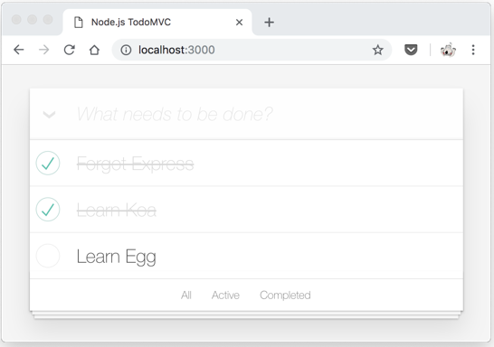

# Node.js Showcase - TodoMVC

[](https://github.com/atian25/node-unittest-showcase/actions/workflows/nodejs.yml)
[](https://codecov.io/gh/atian25/node-unittest-showcase)



## Slide

[浅谈 Node.js 测试 -- 人丑多读书，人懒多单测.pdf](https://github.com/atian25/node-unittest-showcase/blob/master/%E6%B5%85%E8%B0%88%20Node.js%20%E6%B5%8B%E8%AF%95%20--%20%E4%BA%BA%E4%B8%91%E5%A4%9A%E8%AF%BB%E4%B9%A6%EF%BC%8C%E4%BA%BA%E6%87%92%E5%A4%9A%E5%8D%95%E6%B5%8B.pdf)


## Usage

```bash
# install deps
$ npm i

# run as dev
$ npm run dev

# mocha
$ npm test
$ npm run cov

# vitest
$ npm run test:vitest
$ npm run cov:vitest

# node:test
$ npm run test:node

# e2e test
$ npm run test:e2e
```
